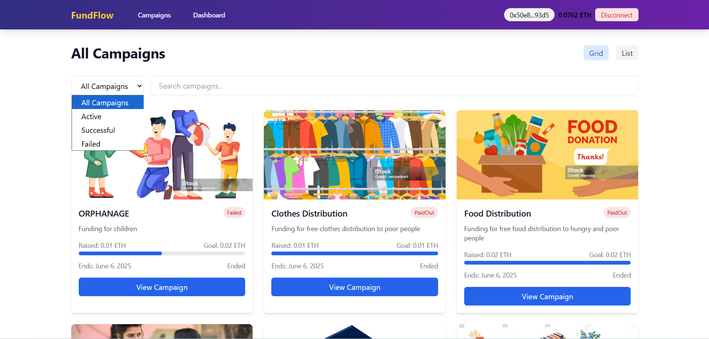

# 🚀 FundFlow – Decentralized Crowdfunding Platform

FundFlow is a blockchain-powered decentralized crowdfunding platform that empowers users to **create**, **explore**, and **contribute** to campaigns transparently using Ethereum. 

Built with a sleek UI using **React.js** .**Ether.js** and **Tailwind CSS**, and secured with smart contracts deployed via **Hardhat**.

---

## 🌐 Live Preview

> ⚠️ This app is designed for **local fullstack deployment** (React + Ether.js).

---

## 🖼️ Screenshots

### 🏠 Home Page


### 📋 All Campaigns


### 📊 Dashboard


### 📊 Dashboard


---

## ✨ Features

- 🔐 **Wallet Integration** – Connect your Ethereum wallet to interact with the platform.
- ➕ **Create Campaign** – Launch your own crowdfunding campaign with custom goals and deadlines.
- 📂 **Explore Campaigns** – Browse all campaigns with filters for All, Active, Successful, and Failed.
- 📊 **Dashboard** – View your created and backed campaigns with real-time status.
- 🧠 **Smart Contract Powered** – Ethereum blockchain ensures transparency and security.
- 🧮 **Live Stats** – Track raised funds, goal completion, and campaign status.
- 📁 **List/Grid Toggle** – Easily switch between layouts for browsing campaigns.
- 🎯 **Progress Bars & Status Tags** – Visual indicators of campaign health.
- 🧾 **Success Metrics** – See overall campaign stats like total raised and success rate.

---

## 🛠 Tech Stack

| Frontend     | Blockchain    | Deployment         |
|--------------|---------------|--------------------|
| React        | Solidity      | Hardhat            |
| Tailwind CSS | Ethers.js     | MetaMask + Sepolia |
| TypeScript   | OpenZeppelin  |        –           |

---
## 📁 Folder Structure
```
CROWDFUNDING/
├── artifacts/ # Hardhat compilation artifacts
├── cache/ # Hardhat cache
├── contracts/ # Smart contracts
├── crowdfunding-dapp/ # Frontend application
├── ignition/ # Deployment scripts
├── scripts/ # Utility scripts
├── test/ # Smart contract tests
├── public/ # Static assets
├── screenshots/ # Application screenshots
├── src/ # React source code
│ ├── components/ # Reusable UI components
│ ├── campaigns/ # Campaign-related components
│ ├── common/ # Shared components
│ ├── dashboard/ # Dashboard components
│ ├── context/ # React context providers
│ ├── hooks/ # Custom React hooks
│ ├── pages/ # Application pages
│ ├── utils/ # Utility functions
│ ├── App.css # Main styles
│ ├── App.js # Root component
│ ├── App.test.js # App tests
│ ├── index.css # Global styles
│ ├── index.js # Entry point
│ ├── logo.svg # Application logo
│ ├── reportWebVitals.js # Performance metrics
│ └── setupTests.js # Test configuration
├── .env # Environment variables
├── .gitattributes # Git attributes
├── .gitignore # Git ignore rules
├── hardhat.config.js # Hardhat configuration
├── package.json # Project dependencies
├── package-lock.json # Dependency lockfile
├── README.md # Project documentation
└── tailwind.config.js # Tailwind CSS configuration
```
---
## 🧑‍💻 Local Setup

```bash
# Clone the repository
git clone https://github.com/your-username/fundflow.git

# Install frontend dependencies
cd fundflow
npm install

# Start the development server
npm run dev
```

To interact with the smart contract:

```bash
# Go to smart contract folder (if separate)
cd smart-contracts

# Install dependencies
npm install

# Compile & deploy to Sepolia testnet
npx hardhat compile
npx hardhat run scripts/deploy.js --network sepolia
```

---

## 💡 Smart Contract Functions

- `createCampaign(...)`
- `contribute(...)`
- `releaseOrRefund(...)`
- `getCampaignCount()`
- `campaigns(uint id)`
- `contributions(uint campaignId, address backer)`

> 📍 **Network**: Sepolia Testnet  
> 🦊 **Wallet**: MetaMask required  

---

## 📜 License

This project is licensed under the [MIT License](LICENSE).

---

> Made with 💙 by Subhankar Das
