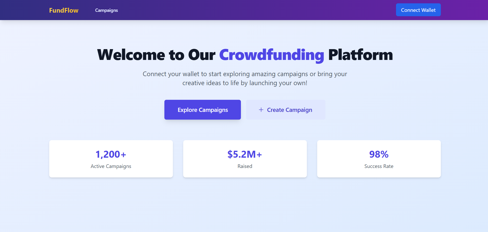

# 🚀 FundFlow – Decentralized Crowdfunding Platform

FundFlow is a blockchain-powered decentralized crowdfunding platform that empowers users to **create**, **explore**, and **contribute** to campaigns transparently using Ethereum. Built with a sleek UI using React and Tailwind CSS, and secured with smart contracts deployed via Hardhat.

---

## ✨ Features

- 🔐 **Wallet Integration** – Connect your Ethereum wallet to interact with the platform.
- ➕ **Create Campaign** – Launch your own crowdfunding campaign with custom goals and deadlines.
- 📂 **Explore Campaigns** – Browse all campaigns with filters for All, Active, Successful, and Failed.
- 📊 **Dashboard** – View your created and backed campaigns with real-time status.
- 🧠 **Smart Contract Powered** – Ethereum blockchain ensures transparency and security.
- 🧮 **Live Stats** – Track raised funds, goal completion, and campaign status.
- 📁 **List/Grid Toggle** – Easily switch between layouts for browsing campaigns.
- 🎯 **Progress Bars & Status Tags** – Visual indicators of campaign health.
- 🧾 **Success Metrics** – See overall campaign stats like total raised and success rate.

---

## 🖼️ Screenshots

### 🏠 Home Page


### 📋 All Campaigns


### 📊 Dashboard


### 📊 Dashboard


> ⚠️ *Make sure these screenshot image files are saved in the `screenshots/` folder of your project repository for them to display properly on GitHub.*

---

## 🛠 Tech Stack

| Frontend     | Blockchain    | Deployment         |
|--------------|---------------|--------------------|
| React        | Solidity       | Hardhat            |
| Tailwind CSS | Ethers.js      | MetaMask + Sepolia |
| TypeScript   | OpenZeppelin   | –                  |

---

## 🧑‍💻 Local Setup

```bash
# Clone the repository
git clone https://github.com/your-username/fundflow.git

# Install frontend dependencies
cd fundflow
npm install

# Start the development server
npm run dev
```

To interact with the smart contract:

```bash
# Go to smart contract folder (if separate)
cd smart-contracts

# Install dependencies
npm install

# Compile & deploy to Sepolia testnet
npx hardhat compile
npx hardhat run scripts/deploy.js --network sepolia
```

---

## 💡 Smart Contract Functions

- `createCampaign(...)`
- `contribute(...)`
- `releaseOrRefund(...)`
- `getCampaignCount()`
- `campaigns(uint id)`
- `contributions(uint campaignId, address backer)`

> 📍 **Network**: Sepolia Testnet  
> 🦊 **Wallet**: MetaMask required  

---

## 📜 License

This project is licensed under the [MIT License](LICENSE).

---

> Made with 💙 by Subhankar Das
